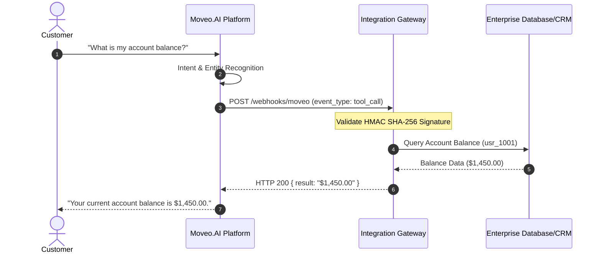
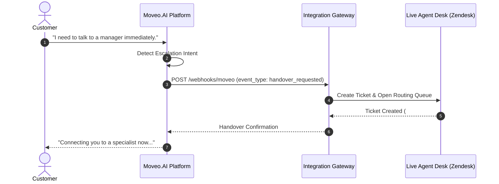

# Moveo.AI Sequence Diagrams

## 1. Automated LLM Tool Calling Flow

```mermaid
sequenceDiagram
    autonumber
    actor Customer
    participant Moveo as Moveo.AI Platform
    participant Gateway as Integration Gateway
    participant Backend as Enterprise Database/CRM

    Customer->>Moveo: "What is my account balance?"
    Moveo->>Moveo: Intent & Entity Recognition
    Moveo->>Gateway: POST /webhooks/moveo (event_type: tool_call)
    Note over Gateway: Validate HMAC SHA-256 Signature
    Gateway->>Backend: Query Account Balance (usr_1001)
    Backend-->>Gateway: Balance Data ($1,450.00)
    Gateway-->>Moveo: HTTP 200 { result: "$1,450.00" }
    Moveo-->>Customer: "Your current account balance is $1,450.00."
```

## 2. Live Human Agent Handover Flow

```mermaid
sequenceDiagram
    autonumber
    actor Customer
    participant Moveo as Moveo.AI Platform
    participant Gateway as Integration Gateway
    participant Desk as Live Agent Desk (Zendesk)

    Customer->>Moveo: "I need to talk to a manager immediately."
    Moveo->>Moveo: Detect Escalation Intent
    Moveo->>Gateway: POST /webhooks/moveo (event_type: handover_requested)
    Gateway->>Desk: Create Ticket & Open Routing Queue
    Desk-->>Gateway: Ticket Created (#TK-9921)
    Gateway-->>Moveo: Handover Confirmation
    Moveo-->>Customer: "Connecting you to a specialist now..."
```
